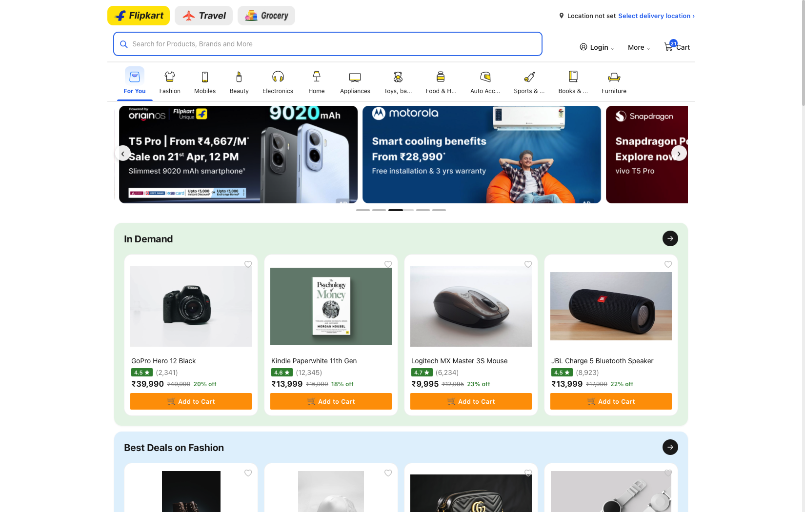
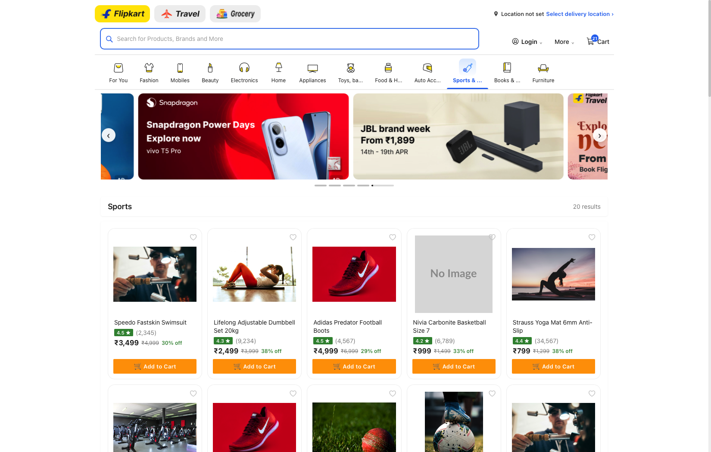
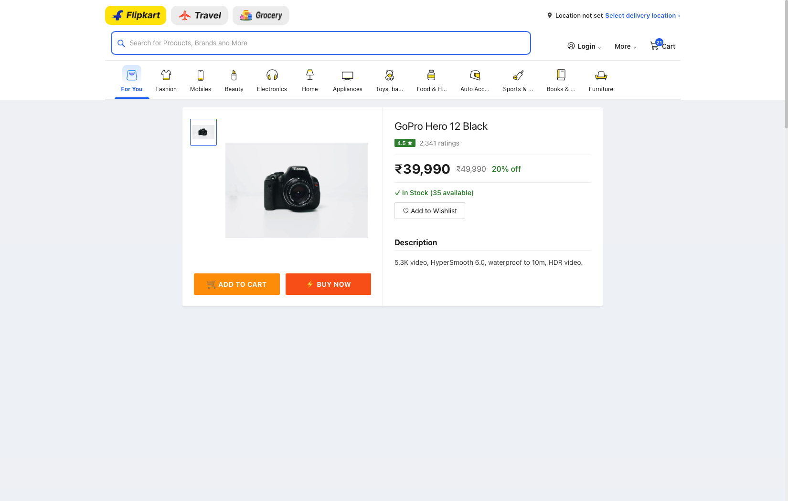
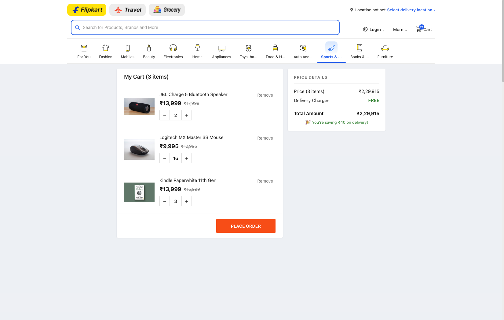
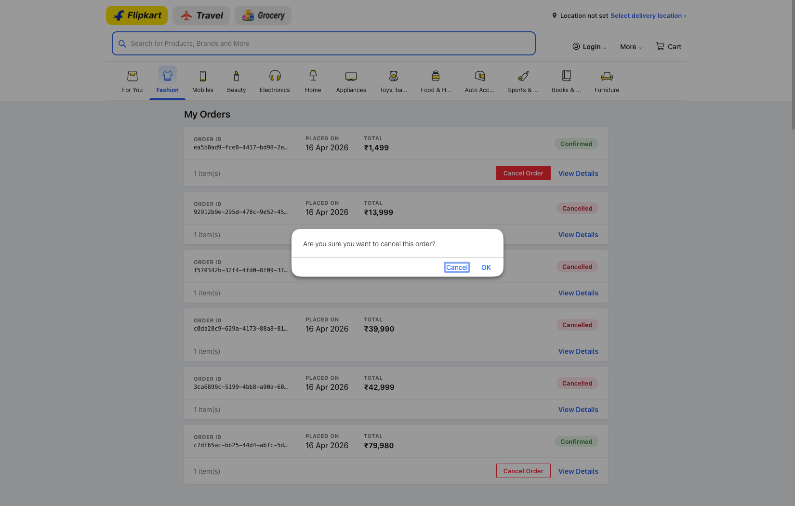
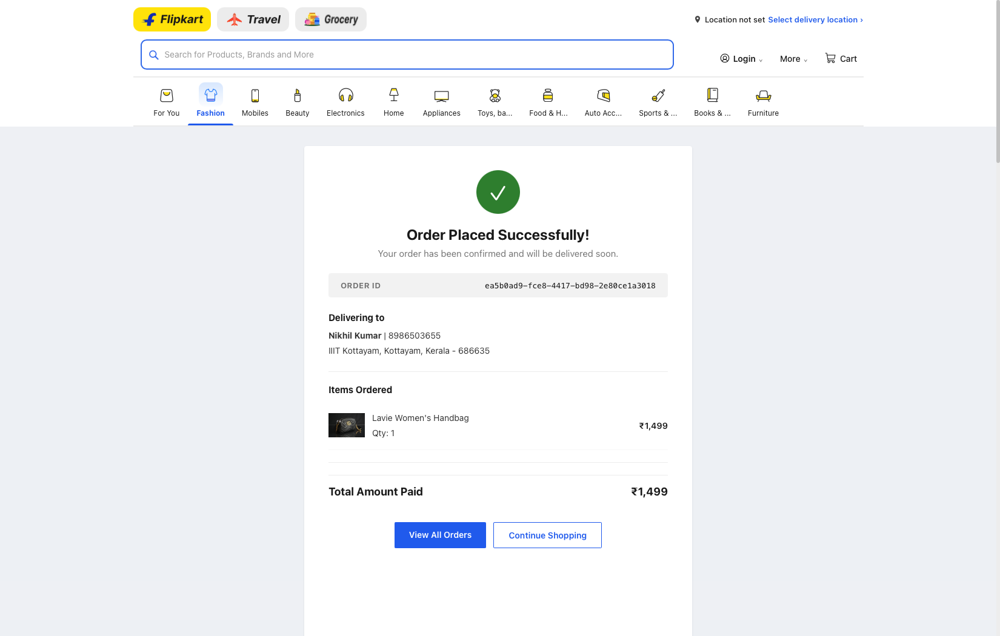
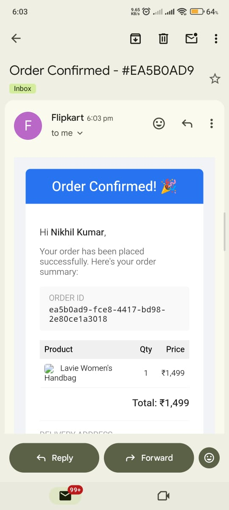
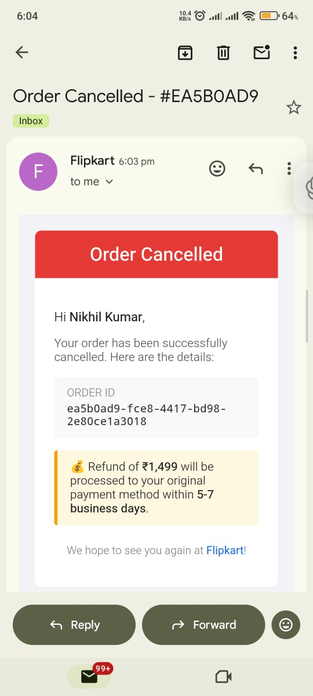
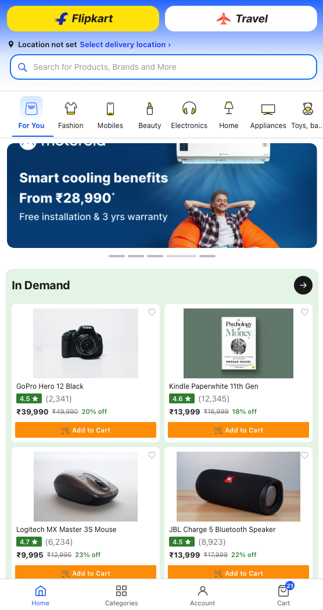

<div align="center">

# Flipkart Clone

A full-stack e-commerce web application replicating Flipkart's UI and core functionality — built as part of the Scaler SDE Assignment.

[](https://flipkart-clone-sigma-eight.vercel.app)
[](https://flipkart-clone-i1eu.onrender.com)

> **Backend is hosted on Render's free tier and goes to sleep after inactivity.**
> Please visit the [Backend URL](https://flipkart-clone-i1eu.onrender.com) first and wait 10–30 seconds for it to wake up before using the frontend.

</div>

---

## Screenshots

### Homepage


### Product Listing


### Product Detail


### Cart


### Order History & Cancel


### Order Confirmation


### Email — Order Confirmed


### Email — Order Cancelled


### Mobile View


---

## Tech Stack

| Layer | Technology |
|-------|-----------|
| Frontend | React.js (Vite), React Router v6, Axios, React Toastify |
| Backend | Node.js, Express.js |
| Database | MySQL (hosted on Aiven Cloud) |
| Email | Nodemailer (Gmail SMTP) |
| Deployment | Vercel (frontend), Render (backend) |

---

## Features

### Core
- Flipkart-style homepage with banner carousel and category sections
- Category navigation bar with animated sliding indicator
- Search by product name / brand
- Filter by category (shown only on search results)
- Product detail page with image carousel, specs, ratings, and stock status
- Add to Cart / Buy Now
- Cart management (add, update quantity, remove)
- Checkout with shipping address + email form
- Order placement with confirmation page
- Order history with status tracking

### Bonus
- Wishlist (add/remove, move to cart)
- Cancel order (restores stock automatically)
- Email notification on order placement (with full order summary)
- Email notification on order cancellation (with refund info)
- Delivery location selector (persists via localStorage)
- Fully responsive — mobile bottom nav, mobile-optimized layout
- Skeleton loading states
- Toast notifications for user feedback
- SEO content section above footer

---

## Database Schema

```
categories         — product categories
products           — product info (price, stock, brand, rating)
product_images     — multiple images per product
product_specs      — key-value specs per product
users              — default user (no auth required)
cart_items         — user's cart (unique per user+product)
wishlist           — user's wishlist
orders             — placed orders with shipping snapshot (incl. email)
order_items        — items in each order (price snapshot)
```

---

## Setup Instructions

### Prerequisites
- Node.js v18+
- MySQL running locally

### 1. Database Setup

```bash
mysql -u root -p < backend/config/schema.sql
```

### 2. Backend Setup

```bash
cd backend
npm install
cp .env.example .env
# Edit .env with your MySQL credentials and email config
```

**`.env` variables:**
```env
DB_HOST=localhost
DB_USER=root
DB_PASSWORD=yourpassword
DB_NAME=flipkart_clone
DB_PORT=3306
PORT=5000

# Gmail App Password (for order emails)
EMAIL_USER=your_gmail@gmail.com
EMAIL_PASS=your_app_password
```

> To get a Gmail App Password: Google Account → Security → 2-Step Verification → App Passwords → generate one for "Mail"

```bash
npm run seed    # seed sample products
npm run dev     # starts on http://localhost:5000
```

### 3. Frontend Setup

```bash
cd frontend
npm install
npm run dev     # starts on http://localhost:5173
```

---

## API Endpoints

| Method | Endpoint | Description |
|--------|----------|-------------|
| GET | `/api/products` | List products (`?search=` / `?category=`) |
| GET | `/api/products/categories` | All categories |
| GET | `/api/products/:id` | Single product with images & specs |
| GET | `/api/cart` | Get cart items |
| POST | `/api/cart` | Add to cart |
| PUT | `/api/cart/:id` | Update quantity |
| DELETE | `/api/cart/:id` | Remove from cart |
| POST | `/api/orders` | Place order + send confirmation email |
| GET | `/api/orders` | Order history |
| GET | `/api/orders/:id` | Order details |
| PATCH | `/api/orders/:id/cancel` | Cancel order + restore stock + send email |
| GET | `/api/wishlist` | Get wishlist |
| POST | `/api/wishlist` | Add to wishlist |
| DELETE | `/api/wishlist/:productId` | Remove from wishlist |

---

## Assumptions

- A default user (id=1, Rahul Sharma) is always logged in — no authentication required per assignment spec
- Delivery is free for orders above ₹500, otherwise ₹40
- Stock is reduced on order placement and restored on cancellation
- Cart is cleared after a successful order
- Email is optional at checkout — confirmation and cancellation emails sent only if provided
- Only `confirmed` or `shipped` orders can be cancelled (`delivered` orders cannot)
- Delivery location is stored in localStorage (no backend persistence needed)
- Product images use external URLs for demo purposes
